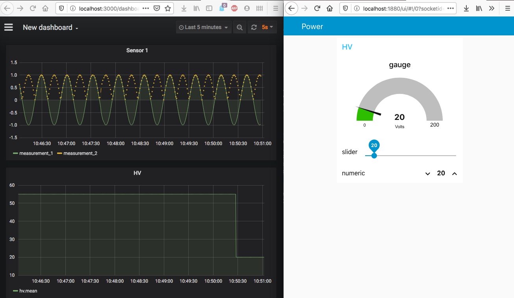

# Tracker DCS Lyon

## Overall Architecture

The system follows a microservice architecture. 
Each module in this architecture is deployed as a docker container. 

The whole architecture is described and managed as a docker-compose stack: 


**DISCLAIMER: this package is under active development, and the stack architecture
is not final.**

Users interact with the architecture through a gateway with two modules: 

* a grafana web server: monitoring dashboards
* a node-red web server: labview equivalent for the slow control and logic

The connection to these modules is secured with TLS. 

In the stack, sensors, devices, and user interfaces mostly communicate with the MQTT protocol, as they
only need to send and receive simple information, like a power-on instruction, 
or a temperature reading as a function of time. 

An exception is the PH2ACF interface. A calibration run will generate a large amount of data.
This data will probably directly be to a MongoDB database, which is more adapted 
to this kind of data. Still, PH2ACF is piloted via MQTT. 

The two databases, InfluxDB and MongoDB, are synchronized via a timestamp 
attached to the data. 

*Never used Telegraf*

## Installation 

The architecture is deployed with Docker, and we use docker images built for X86_64 systems. 
Therefore, the tracker DCS stack can run on any computer with this architecture (PC, macs). 
The software stack is described and supervised by docker-compose. 

For an introduction to docker, docker-compose, InfluxDB, and Grafana,
you could check [this blog article](https://thedatafrog.com/en/articles/docker-influxdb-grafana/)

To install, first clone this repository to your machine, and go inside: 

```
git clone https://github.com/cbernet/tracker_dcs.git
cd tracker_dcs
```

Then, install the docker engine and docker-compose for your machine as instructed below. Both tools are available in Docker Desktop.

### Mac OS

[Install Docker Desktop on a mac](https://docs.docker.com/docker-for-mac/install/)

### Linux

[Install the docker engine](https://docs.docker.com/engine/install/) for your platform. 

Then, I suggest to [install docker-compose with pip](https://docs.docker.com/compose/install/#install-using-pip), the python package manager. Make sure you use python3, and that pip is connected to your version of python3. 

### Windows

Please note the system requirements before attempting the install, 
docker desktop cannot be installed on all versions of Windows! You probably need Windows
64 bit Pro or Education, and to be an administrator of your machine. 

[Install Docker Desktop on Windows](https://docs.docker.com/docker-for-windows/install/)


## Running

To start the stack in production mode: 

```
docker-compose up -d 
```

## Accessing the services from the host machine

### Grafana and Node-red web GUIs

* grafana: [http://localhost:3000](http://localhost:3000)
* node-red: [http://localhost:1880](http://localhost:1880)

Passwords : ask Colin


## Development mode and unit tests

In development mode, there is a port mapping between the host and the services 
in all containers in the stack. This allows to access all services from the host
machine for testing purpose, not only grafana and node-red. 

To start the stack in development mode: 

```
docker-compose -f docker-compose.yml -f docker-compose.dev.yml up -d
```

To run the unit test suite: 

```
python -m unittest discover trackerdcs/
```

Please make sure all tests pass before sending a PR to this repository.

## Demonstrator 

The demonstrator features: 

* controllable, dummy high-voltage and low-voltage modules
* a dummy sensor producing two measurements

To start the demonstrator, do 

```
docker-compose -f docker-compose.yml -f docker-compose.dev.yml -f docker-compose.dummy.yml up -d
```

Then access: 

* the grafana dashboard: [http://localhost:3000](http://localhost:3000)
* the node-red user interface: [http://localhost:1880](http://localhost:1880/ui)

You should be able to control the HV module, and to see the results in grafana: 




## TODO

* think about user interface and access
* think about global architecture: inputs, outputs, role of mqtt and db, ... 
* data generator in nodered to mqtt
* influxDB loader (mqtt listener)
  * python script? **Telegraf?**
  * think about topic naming for the loader
* grafana dashboard to look at the data from influxdb
  * how to initialize pre-built dashboard?    
* install nodered modules npm 
  * ask pavel about the utility of each package
* test mqtt broker from outside, from inside 
* set up a mockup test suite? 
* security: 
  * grafana: just change password
  * nodered: how to handle credentials
  * influxdb: keep it confined - expose? 
  * mosquitto: keep it confined - securing mosquitto is too painful. 
* backups: set up a backup procedure for all named volumes in the stack 


