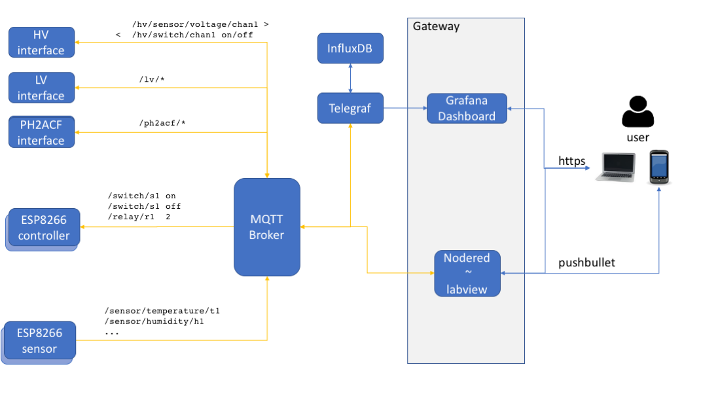

# Tracker DCS Louvain

## Overall Architecture

The system follows a microservice architecture. 
Each module in this architecture is deployed as a docker container. 

The whole architecture is described and managed as a docker-compose stack: 



**DISCLAIMER: this package is under active development, and the stack architecture
is not final.**

Users interact with the architecture through a gateway with two modules: 

* a grafana web server: monitoring dashboards
* a node-red web server: labview equivalent for the slow control and logic

The connection to these modules is secured with TLS. 

In the stack, sensors, devices, and user interfaces mostly communicate with the MQTT protocol, as they
only need to send and receive simple information, like a power-on instruction, 
or a temperature reading as a function of time. 

An exception is the PH2ACF interface. A calibration run will generate a large amount of data.
This data will probably directly be to a MongoDB database, which is more adapted 
to this kind of data. Still, PH2ACF is piloted via MQTT.
The two databases, InfluxDB and MongoDB, are synchronized via a timestamp 
attached to the data. 
**Note**:this is not implemented yet.

## Installation 

The architecture is deployed with Podman, and we use docker images built for X86_64 systems. 
Therefore, the tracker DCS stack can run on any computer with this architecture (PC, macs). 
Podman is a drop-in replacement for Docker that allows to run on a machine without administrator rights, and makes it easier to implement stacks of several applications that need to communicate (similarly to docker-compose). In particular, all services simply interact by connecting to localhost.

For an introduction to docker, docker-compose, InfluxDB, and Grafana,
you could check [this blog article](https://thedatafrog.com/en/articles/docker-influxdb-grafana/)

To install, first clone this repository to your machine, and go inside: 

```
git clone https://github.com/cbernet/tracker_dcs.git
cd tracker_dcs
```

Then, [install podman](https://podman.io/getting-started/installation) for your platform. 

I suggest to follow the instructions to [setup rootless podman](https://github.com/containers/podman/blob/master/docs/tutorials/rootless_tutorial.md).


## Creating the stack

First, we create a pod:

```
podman pod create --name tracker_dcs -p 8086 -p 3000 -p 1880 -p 1883
```

Ports are shared for influxdb (8086), grafana (3000), nodered (1880), and mosquito (1883).

First build the required image (later could put them on a registry):

```
podman build -t localhost/node-red ./node-red
podman build -t localhost/pyepics ./trackerdcs
```

Create the directories which will be bind-mounted:
```
mkdir influxdb grafana
```

Then start influxDB:
```
podman run --pod tracker_dcs -d --init --userns=keep-id --name tdcs_influx -v ./influxdb:/var/lib/influxdb influxdb
```
If it's the first time, you might need to create a test DB:
```
$ podman exec -it tdcs_influx influx
> create database testdb
```

Then, run the containers for telegraf, mosquitto, grafana and node-red:

```
podman run --pod tracker_dcs -d --init --name telegraf -v ./telegraf.conf:/etc/telegraf/telegraf.conf:ro telegraf
podman run --pod tracker_dcs -d --init --userns=keep-id --name tdcs_mosquitto -v mosquitto_data:/mosquitto/data -v mosquitto_log:/mosquitto/log -v ./mosquitto/mosquitto.conf:/mosquitto/config/mosquitto.conf eclipse-mosquitto
podman run --pod tracker_dcs -d --init --userns=keep-id -u $(id -u) --name tdcs_grafana -v ./grafana:/var/lib/grafana grafana/grafana
podman run --pod tracker_dcs -d --init --userns=keep-id --name tdcs_node-red -v ./node-red/data:/data localhost/node-red
```

We use `--userns=keep-id` and (`-u $(id -u)` for grafana because by default it runs with a different user) to be able to write to the bind volumes.

SLC/CC7 note (older podman?): it seems the containers should run as root with `-u 0:0` and no `--userns`; also `--init` is not supported there.

## Running

### Development from remote

It is possible to run the stack "locally", on a machine outside the UCL network. To make sure the DCS can access the hardware, you'll need to do the following:

- `sshuttle -r server02.fynu.ucl.ac.be 130.104.48.0/24` (redirects all trafic through server02)
- On the DAQ PC, open a connection and pipe the Julabo serial control through it:
```
stty -F /dev/ttyUSB0 4800 crtscts cs7 -parodd
nc -lkv 8000 > /dev/ttyUSB0 < /dev/ttyUSB0
```

### Launching the DCS

We can then run the CAEN power supply control backend, specifying the IP of the CAEN mainframe, and the YAML file listing the PS channels and connected modules (see [example](trackerdcs/caen-fsm/example.yml)):

```
podman run --pod tracker_dcs -d --init -e EPICS_CA_NAME_SERVERS=130.104.48.188 -e EPICS_CA_AUTO_ADDR_LIST=NO -v ./trackerdcs/caen-fsm:/usr/src/app/caen-fsm localhost/pyepics python -u caen-fsm/dcs.py --mqtt-host localhost --verbose caen-fsm/example.yml
```

And the Julabo chiller control backend (add `--remote` at the end when working from outside):

```
podman run --pod tracker_dcs -d --init -v ./trackerdcs/julabo-fsm:/usr/src/app/julabo-fsm localhost/pyepics python -u julabo-fsm/julabo_serial.py --verbose --mqtt-host localhost --start-mqtt
```

Note: when running inside the UCL network EPICS can also work with `-e EPICS_CA_AUTO_ADDR_LIST=130.104.48.188` instead of the above.


## Accessing the services

Passwords : ask Sebastien

### From the host machine

* grafana: [http://localhost:3000](http://localhost:3000)
* node-red: [http://localhost:1880](http://localhost:1880)
* node-red UI: [http://localhost:1880/ui/](http://localhost:1880/ui/)

### From remote

To connect from outside the UCL network to the pod services running on the DAQ PC inside, run in three separate terminals:

- `sshuttle -r server02.fynu.ucl.ac.be 130.104.48.0/24`
- `ssh -L 1880:localhost:1880 130.104.48.63`
- `ssh -L 3000:localhost:3000 130.104.48.63`

You can then access the pages at:

* grafana: [http://130.104.48.63:3000](http://130.104.48.63:3000)
* node-red: [http://130.104.48.63:1880](http://130.104.48.63:1880)
* node-red UI: [http://130.104.48.63:1880/ui/](http://130.104.48.63:1880/ui/)

## TODO

* share grafana configuration
* set up a mockup test suite? 
* security: 
  * grafana: just change password
  * nodered: how to handle credentials
  * influxdb: keep it confined - expose? 
  * mosquitto: keep it confined - securing mosquitto is too painful. 
* backups: set up a backup procedure for all named volumes in the stack 


